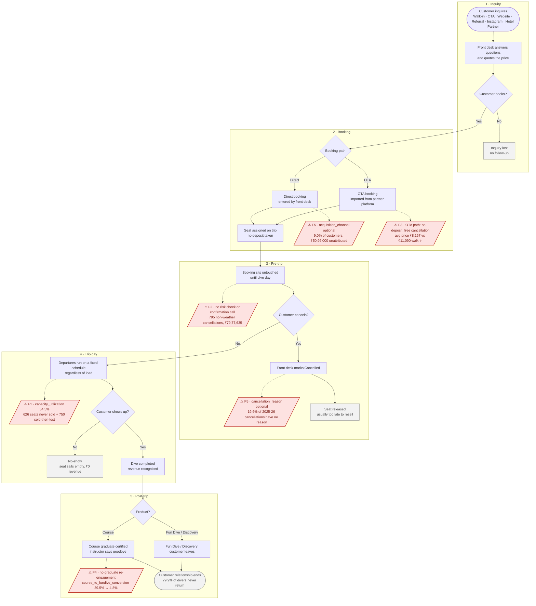

# As-Is Process Flow — Booking Lifecycle

Project: scuba-dive-analytics (local folder: Scuba). Phase 1.

This page shows how a customer moves through the dive centre today, from first
inquiry to the end of the trip. The red nodes mark the failure points behind the
findings in [`FINDINGS.md`](FINDINGS.md) §2. They are labelled **F1–F5**, matching
insights ①–⑤.

## Failure points

| Label | Where it happens | What goes wrong | Measured impact | FINDINGS ref |
|---|---|---|---|---|
| **F1** | Trip day: scheduling | Departures run at fixed times however many seats are booked. Booked seats are lost, and other seats are never sold | `capacity_utilization` 58.0% → **54.5%**. 2025-26: **750 seats sold then lost, 626 never sold** | §2① · `sql/01 Q2` |
| **F2** | Pre-trip | Nobody contacts bookings that are likely to cancel. Most cancellations happen on diveable days | **795 non-weather cancellations (59.6%), ₹79,77,635**. On calm or moderate days 12.7% of bookings cancel, and these days account for 58.9% of all cancellations | §2② · `sql/06 Q1–Q3` |
| **F3** | Booking: OTA path | OTA bookings carry no deposit, so cancelling costs the customer nothing | OTA `cancellation_rate` **27.8%**, `no_show_rate` **7.5%**, **486 seats lost**, `customer_ltv` ₹9,533 | §2③ · `sql/06 Q4–Q5` |
| **F4** | Post-trip: course | Graduates are not contacted after certification | `course_to_fundive_conversion` **39.5% → 16.1% → 4.8%**. 90-day check: 27.8% → 3.7% | §2④ · `sql/03 Q3–Q4` |
| **F5** | Booking and cancellation capture | `acquisition_channel` and `cancellation_reason` can be left blank | No-reason cancellations **7.7% → 19.6%**. **₹50,96,000 (9.3%)** of revenue has no channel | §2⑤ · `sql/02 Q6` |

The matching redesign is in [`TO_BE_FLOW.md`](TO_BE_FLOW.md).
