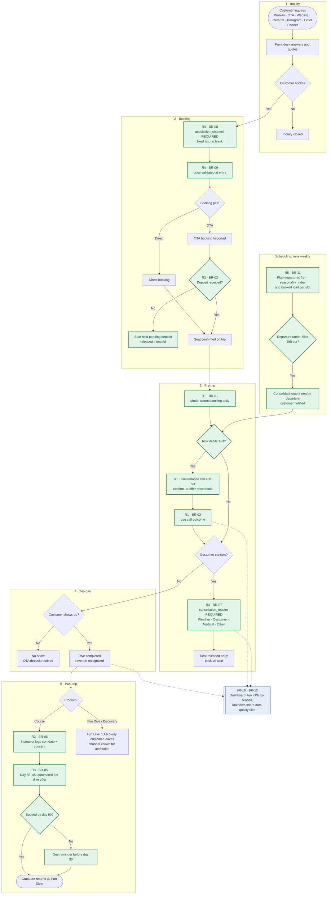

# To-Be Process Flow — Booking Lifecycle After R1–R5

Project: scuba-dive-analytics (local folder: Scuba). Phase 5.

This is the same lifecycle as [`AS_IS_FLOW.md`](AS_IS_FLOW.md), redesigned with all
five recommendations in place. Green nodes are new controls. Each one is tagged with
its recommendation (**R1–R5**) and business requirement (**BR-xx**, see
[`BRD.md`](BRD.md)).

## What changed, and which As-Is failure each change closes

| Rec | New control | Closes | Evidence it is aimed at | Trigger / rule |
|---|---|---|---|---|
| **R1** | Daily risk scoring and a confirmation call for deciles 1–3 | F2 | Top 3 deciles = **58.1% of cancellations in 30% of bookings**, precision 49.8% (FINDINGS §3) | Dive date minus 48 h. Decile 1–3 only. The model picks the group; it does not give a probability per booking |
| **R2** | Deposit gate on the OTA path | F3 | OTA `cancellation_rate` 27.8%, `no_show_rate` 7.5%, 486 seats lost (FINDINGS §2③) | Seat is not confirmed until the deposit lands. Deposit size is set by the owner (see OQ-2) |
| **R3** | Automated graduate re-engagement | F4 | 69% of returns happen within 90 days, median **49 days** (FINDINGS §2④) | Offer at day 30–45, one reminder before day 90 |
| **R4** | Mandatory `acquisition_channel` and `cancellation_reason`, plus price validation | F5 | 19.6% of cancellations have no reason. ₹50,96,000 has no channel (FINDINGS §2⑤) | A record cannot be saved with these fields blank |
| **R5** | Departures planned against demand. Under-filled boats consolidated | F1 | `capacity_utilization` 54.5%. 626 seats never sold. Jan index 192 vs Jul–Aug 0 (FINDINGS §1, §2①) | Weekly review. Consolidate at 48 h |

> **Open items carried from [`BRD.md`](BRD.md) §6.** If the shop already takes
> deposits (**OQ-2**), the R2 gate means *enforcing the deposit on OTA* rather than
> introducing one. The Peak/Shoulder split R5 plans against (**OQ-4**) is an
> assumption until the owner confirms it.
